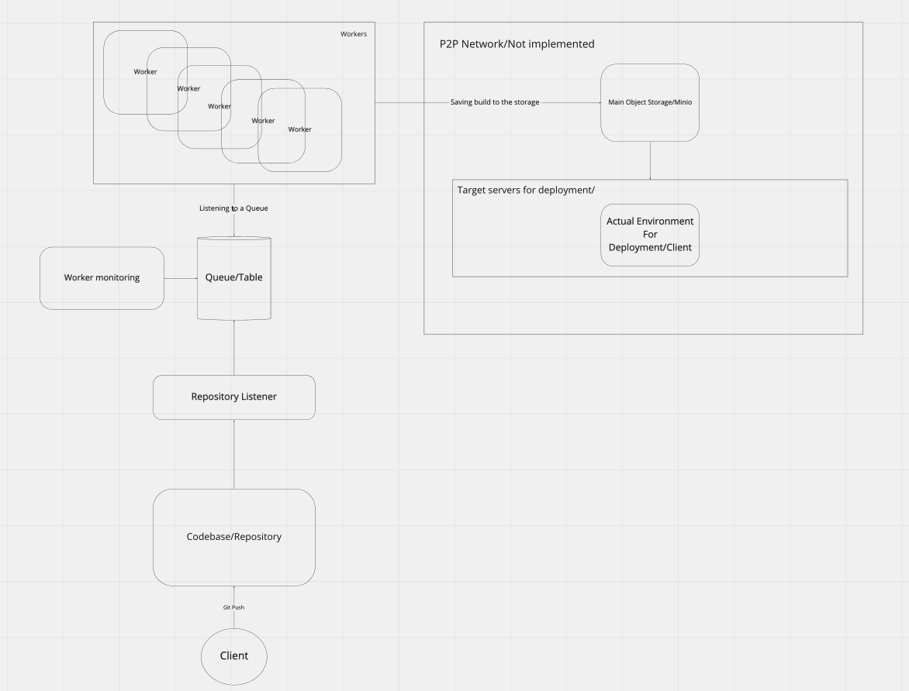

# algoexpert-system-design-practice

### These are proof of concept projects built based on AlgoExpert system's expert course

### 1. Code Deployment System

#### System Design:
 

#### How to run:
1. Install docker desktop and enable kubernetes
2. Build docker images for each app respectively for each k8 deployment 
3. Run `kubectl apply -f .` in each k8 directories following this order:
    1. `config-maps`
    2. `first-phase-deployments`
    3. All the others in the k8 directory
4. Go to `localhost:3000` register and create repository named `test-repo`
5. Go to repo's settings ad add `Webhook` with target url: `http://repo-listener-service:5000/repo-webhook` and `Trigger On` all events.
6. Push `index.html` file to the `test-repo`
7. Go to `localhost:80` to check the result (every time you change `index.html` this page must update automatically)
8. Delete all deployments: `kubectl delete all --all`   
 